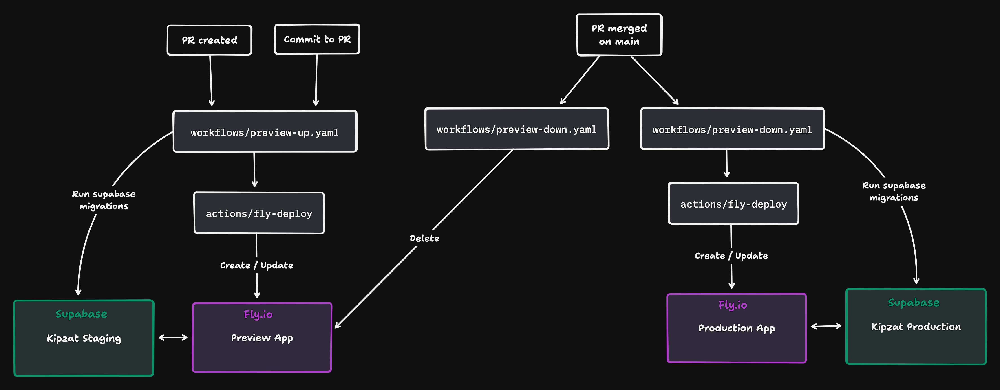

# CI/CD

There are 3 workflows: 
- `preview-up.yaml` => deploy preview app to fly.io (at each commit on PRs)
- `preview-down.yaml` => destroy preview app on fly.io (when closing or merging a PR)
- `production-up.yaml` => deploy production app to fly.io (when merging on main branch)

`preview-up.yaml` and `production-up.yaml` use a custom action (`actions/fly-deploy`), which is a wrapper around `flyctl`, in order to deploy apps to fly.io.

