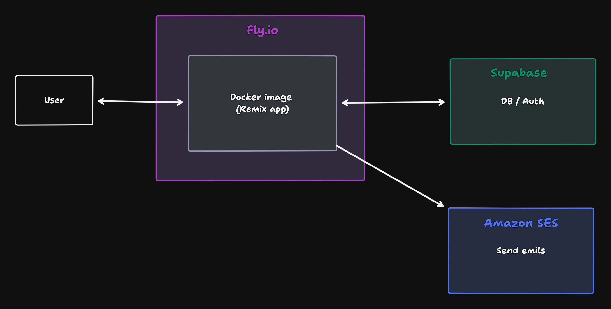

# Infra

This is a very simple infra which uses [Fly.io](https://fly.io/) to deploy the web app as a docker image (`apps/web/Dockerfile`).

## Services

Our infrastructure also leverages:

1. **Supabase**: For database, authentication, and backend services.
2. **Amazon SES (Simple Email Service)**: For reliable email delivery.

## Infrastructure Schema

